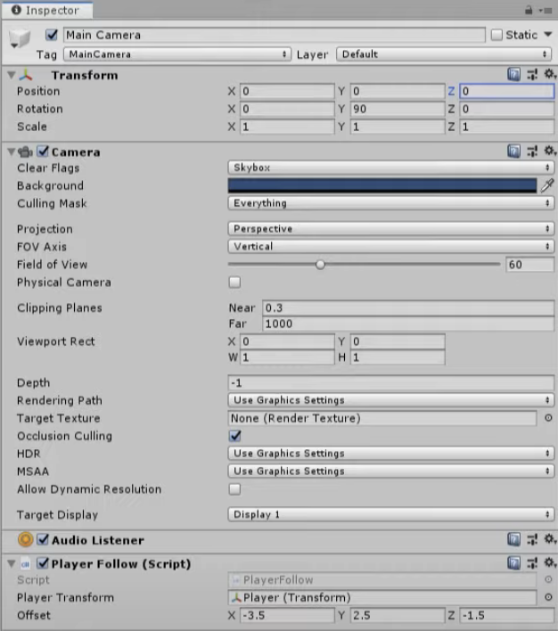

## Section 2 - Camera

In this section, we will be establishing a simple camera system that will follow and rotate around the player. 

#### Summary:
1. Program the camera to track and follow the player
2. Update camera rotation based on player's input
3. Lock and hide cursor visibility

## Setting Up Player Tracking
The first thing we need the camera to do is keep track of the player's position and update its own position to follow the player.
Navigate to your Player scripts folder `Assets > Scripts > Player` and create a new script called <ins>PlayerFollow.cs</ins>.
Then double click the script to edit it.

```
#region Editor variables
[SerializeField]
[Tooltip("The player to follow")]
private Transform m_PlayerTransform;

[SerializeField]
[Tooltip("The offset from the player's origin to the camera")]
private Vector3 m_Offset;
#endregion
```
Set up the following variables. Remember! `[SerializeField]` is needed for your variables to be editable in the Unity inspector.
- `m_PlayerTransform` will be the player's position in the form of a *Transform* component
- `m_Offset` will be the distance of the camera from the player

**Task 2.1: In <ins>PlayerFollow.cs</ins> create a new region called "Main Updates." Inside this region, set up a private void `LateUpdate()` function. This function 
should find the new position of the camera (player's position + offset) and set the camera's transform to the new position.**

{: .hint}
>Transform actually holds the GameObject's position, rotation, and scale. Use `.position` to specifically refer to the GameObject's position.


{: .hint}
>`Vector3.Slerp(Vector3 a, Vector3 b, 1)` is a useful function for interpolating smoothly between Vector3 `a` to `b`! [Check out the documentation to learn more!](https://docs.unity3d.com/ScriptReference/Vector3.Slerp.html)

Once you are done implementing the task, attach the <ins>PlayerFollow.cs</ins> script onto your `Main Camera` in the hierarchy. 
Once you've attached the script, make sure that your camera setting is the same as shown in the figure below (for the offset values, feel free to play around and find what works best for you!):

\
Fig 2.1

Before moving onto the next part of this section, make sure to test out the game and see if the camera tracks the player if you haven't already!

## Rotating Your Camera

Once you've correctly implemented player tracking, you will notice that the camera will follow the player but will only face one direction.
In order to fix this, let's go back into our "Editor variables" region of <ins>PlayerFollow.cs</ins> then add the following serializable variable:

```
[SerializeField]
[Tooltip("How quickly the player can rotate the camera to the left and the right"]
private float m_RotationSpeed = 10;
```

- `m_RotationSpeed` is how fast the player's camera can rotation left and right. The default value will be set at 10,
however this still means that we can edit the value in the Unity inspector

**Task 2.2: In the `LateUpdate()` function. Add the following lines of code onto the function.**

```
float rotationAmount = m_RotationSpeed * Input.GetAxis("Mouse X");
transform.RotateAround(m_PlayerTransform.position, Vector3.up, rotationAount);

m_offset = transform.position - m_PlayerTransform.position;
```

In this block of code, we first define `rotationAmount` which is the value of our rotation, both the amplitude and direction. It is our rotation speed multiplied by the x-axis value of our mouse position.
We use `rotationAmount` in `transform.RotateAround` to change the camera's transform's rotation around the origin which is the player's position or `m_PlayerTransform.positon`. 

Lastly, to avoid bugs after all of our camera updates, we make sure that `m_offset` is equal to the camera's position subtracted by the player's position.

## Player's Cursor

When you play your game, you will see that the mouse will be visible on the screen and strange camera behaviors may arise when your cursor
hits or moves off the side of the game window. In order to avoid this, we will implement our last feature in this section: locking the camera. 

**Task 2.3: Navigate to the <ins>PlayerController.cs</ins> script. Inside the "Initialization" region, create a private void `Start()` function and write the following line of code:**
```
Cursor.lockState = CursorLockMode.Locked;
```

Now once you play the game, you won't see the cursor. To bring back your mouse, click ESC on your keyboard.
That concludes the section on camera! Test out your game to make sure everything was correctly implemented and remember to **make your camera `Main Camera` into a prefab** for future reference by dragging it from the hierarchy into the Prefab folder. 

Solution (translate hex to ASCII):
```
68 74 74 70 73 3A 2F 2F 77 77 77 2E 79 6F 75 74 75 62 65 2E 63 6F 6D 2F 77 61 74 63 68 3F 76 3D 56 61 75 49 50 32 6D 39 41 6B 6B 26 6C 69 73 74 3D 50 4C 6B 54 71 66 35 44 42 7A 50 73 44 51 44 54 59 6F 72 63 58 38 52 49 63 78 7A 56 43 2D 73 67 4F 36 26 69 6E 64 65 78 3D 33
```
